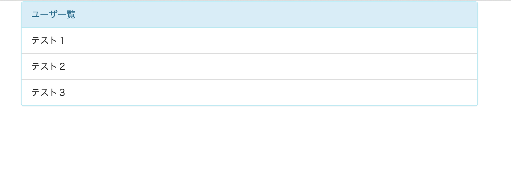

# 課題１
## やること
* backboneのviewを作成してユーザ一覧の画面を表示してみる

## 覚えてほしいこと
* backboneのviewの使い方

## workディレクトリ内の構造の確認
<pre>
- work
  - index.html
    ベースとなるhtmlファイルです
    このファイルをブラウザで開くことでアプリを表示することができます
  - styles
    cssを入れるディレクトリです
    - app.css
      独自のcssを定義するファイルです
  - scripts
    jsのファイルを入れるディレクトリです
    - main.js
      jsファイルの起点となるファイルです
    - app.js
      browserifyによってひとまとめにされたファイルです
      このファイルをhtmlで読み込みます
    - collections
      collectionのファイルを入れるディレクトリです
    - models
      modelのファイルを入れるディレクトリです
    - views
      viewのファイルを入れるディレクトリです
</pre>

## 動作確認
* テンプレートとしてすでに用意されている内容を確認します
* index.htmlをブラウザで開き以下の内容が表示されていればOKです


## ユーザ一覧を表示する
* それではここから実際にコードを書いていきましょう

#### ユーザ一覧を表示するスペースを作る
  * index.htmlを開いて下さい
  * 動作確認用に書かれていたHelloWorldの行を削除して下さい
  * 次にユーザ一覧を表示するスペースを作成します
  * 以下の内容をbodyの中に書いて下さい
  <pre>`<div id="users" class="container"></div>`</pre>
  * このdivタグの中にユーザ一覧のviewを入れる形になります

#### ユーザ一覧viewの作成
  * ユーザ一覧を表示するためのviewを作成していきます
  * scripts/view/の中にUserView.jsというファイルを作成して下さい
  * まずはライブラリを使えるようにするための決まり文句を記述します
    <pre>
      `var $ = require('jquery');`
      `var _ = require('underscore');`
      `var Backbone = require('backbone');`
    </pre>
  * この記述によってnode_modules以下にあるjqueryやbackboneを使えるようになります
  * 次にbackboneのviewを継承します
  * module.exportsとしておくと他のファイルからこのファイルを呼び出せるようになります
    <pre>
      `module.exports = Backbone.View.extend({`
        `// ここにviewの処理を書いていく`
      `});`
    </pre>
  * viewの大枠ができたので、次はbackboneのviewを使う際のルールに従っていくつか書いていきます
  * el
    * elにはjqueryのselectorのような書き方で、このviewがhtmlのどの部分に入れ込まれるのかを指定します
    * 今回はindex.htmlにidがusersのスペースを用意したので以下のように記述します
    <pre>````el: '#users',````</pre>
  * template
    * elではviewを入れ込む場所を指定しましたが、templateでは入れ込む内容(html)を指定します
    * viewに直接htmlを書いてもいいですが、一般的にhtmlはindex.html側に記載しviewからそれを呼び出します
    * index.htmlのbody内に以下の記述を追記して下さい
    <pre>
      `<script id="users_view" type="text/template">`
        `<div class="panel panel-info">`
          `<div class="panel-heading">ユーザ一覧</div>`
          `<ul id="user_list" class="list-group">`
            `<li class="list-group-item">テスト１</li>`
            `<li class="list-group-item">テスト２</li>`
            `<li class="list-group-item">テスト３</li>`
          `</ul>`
        `</div>`
      `</script>`
    </pre>
    * テンプレートとして使いたいhtmlをidがusers_viewのタグ内に記述しました
    * viewのtemplateとして以下のように記述して下さい
    <pre>
    `template: _.template($('#users_view').html()),`
    </pre>
  * render
    * 表示する内容と場所の設定ができたので、次は描画する処理をrenderに記述します
    * renderのfunctionを定義します
    <pre>
      `render: function() {`
        `//処理を書く`
      `});`
    </pre>
    * 枠組みはできたのでrenderの処理を記述します
    <pre>
      `this.$el.html(this.template());`
      `return this;`
    </pre>
    * これでviewの準備はできました

#### ユーザ一覧を画面に表示する
* ここまでで必要なパーツの準備はできました
* 最後にそれらを呼び出すことで画面に表示させます
* jsの実行はscripts/main.jsを起点に動作します
* main.jsを作成しここまでに作ったviewを呼び出してみます
* まずはUsersViewを作成した時と同じライブラリを使うための決まり文句を書きます
 <pre>
    `var $ = require('jquery');`
    `var _ = require('underscore');`
    `var Backbone = require('backbone');`
  </pre>
* 次にUsersViewも使うのでこれもrequireします
  <pre>`var UsersView = require('./views/UsersView');`</pre>
* 自分で作成したファイルをrequireする時はパスを正しく書く必要があります
* またファイルの拡張子は省略できます
* あとはUsersViewのインスタンスを作成しrenderメソッドを呼ぶだけです
  <pre>
    `var usersView = new UsersView();`
    `usersView.render();`
  </pre>

#### 正しく動くか確認する
* jsファイルを修正したのでgulpコマンドを実行します
  * エラーが出た場合は表示されているファイルの行を確認して下さい
* ブラウザでindex.htmlを開いて下さい
* 以下の内容が表示されていればOKです


## 開発内容の確認
* 課題1が完了した状態のサンプルがあるので自分で書いたコードと見比べて見てください
* [kadai1](./kadai1)
