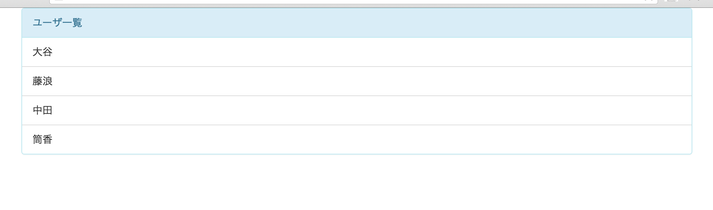

# 課題２
## やること
* backboneのmodelとcollectionを作成し、modelに登録されているユーザを画面に表示する

## 覚えてほしいこと
* backboneのmodelとcollectionの作り方
* modelとcollectionに紐付いたviewの使い方

## modelに登録されたユーザ一覧を表示する

#### modelの作成
  * modelはデータベースにUserテーブルがあるとしてUserテーブルの1行1行を操作するようなイメージです
  * scripts/models/にUser.jsを作成して下さい
  * まずはbackboneを使えるようにするために以下の内容を記述して下さい 
  <pre>`var Backbone = require('backbone');`</pre>
  * 次にbackboneのmodelを継承するので以下の記述をします
  * module.exportsは前回同様このファイルを別のファイルから呼び出せる(requireできる)ようにするための記述です
  <pre>
    `module.exports = Backbone.Model.extend({`
      // modelの処理を書く
    `});`
  </pre>
  * 現段階ではmodelの定義だけできてればよいので中身は空っぽのままでOKです

#### collectionの作成
  * collectionは複数のモデルをまとめて管理するものです
  * modelをリストで所持しています
  * scripts/collections/にUsers.jsを作成して下さい
  * modelの時と同様にbackboneを使えるようにするために以下を記述します
  <pre>`var Backbone = require('backbone');`</pre>
  * Userモデルを使用するのでこちらもrequireします
  <pre>`var User = require('../models/User');`</pre>
  * backboneのcollectionを継承するので以下の記述をします
  <pre>
    `module.exports = Backbone.Collection.extend({`
      // collectionの処理を書く
    `});`
  </pre>
  * 次にこのcollectionがどのmodelを束ねているのか設定します
  <pre>`model: User`</pre>
  * これでcollectionの準備はOKです

#### Viewの構造をmodelとcollectionに対応づけ
* 課題１ではUsersViewのみを作りましたが課題２ではviewをmodelとcollectionに対応づけて考えます
  * model -> UserView.js
  * collection -> UsersView.js
* 課題１の段階では以下の内容をUsersViewで表示していました
<pre>
  `
`
    `
ユーザ一覧
`
      `<ul id="user_list" class="list-group">`
        `<li class="list-group-item">テスト１</li>`
        `<li class="list-group-item">テスト２</li>`
        `<li class="list-group-item">テスト３</li>`
      `</ul>`
    `
`
  `
`
</pre>
* この内容をUserViewとUsersViewで分担します
  * UserViewは個々のmodelを表現するので以下の部分を担当することになります
  <pre>`<li class="list-group-item">テスト１</li>`</pre>
  * UsersViewは複数のmodelを束ねている部分を表現しているので以下の部分を担当することになります
  <pre>
    `
`
      `
ユーザ一覧
`
        `<ul id="user_list" class="list-group">`
        `</ul>`
      `
`
    `
`
  </pre>

#### UserViewを作る
* まずはUserViewから対応していきましょう
* scripts/views/にUserView.jsを作成して下さい
* いつも通りのライブラリの読み込みを記述します
<pre>
  `var $ = require('jquery');`
  `var _ = require('underscore');`
  `var Backbone = require('backbone');`
</pre>
* backboneのviewを継承したviewを定義します
<pre>
  `module.exports = Backbone.View.extend({`
    `// ここにviewの処理を書いていく`
  `});`
</pre>
* 次に$elを作成するための設定を書きます
* tagName
<pre>`tagName: 'li',`</pre>
* className
<pre>`className: 'list-group-item',`</pre>
* 課題１ではel: '#users'で$elを設定しましたが今回はtagNameを使っています
* 少し話はそれますがこの違いについて確認しておきます
* elとtagNameの違い
  * どちらのパターンもやっていることは$elの設定です
  * $elはthis.$el.html(this.template())のように使うので、$elはtemplateを入れ込む場所ということです
  * el:xxxと設定した場合は$('xxx')で取得した内容が$elになります
    * $elにしたい部分がすでにindex.html等に定義されている場合はelを使います
  * tagName:xxxと設定した場合`<xxx></xxx>`が$elとなります
    * $elにしたい部分をその場で作りあげる場合はtagNameで定義します
  * 違いは上記の通りですがどのように使いわけるかというと、そのviewが同時にいくつも表示されるかどうかで判断します
  * 課題１の方は同時に１つしか表示しないので、templateを入れ込む場所($el)は１つあれば十分です(なのでindex.htmlに書いてしまっている)
  * 課題２のUserViewはmodelの数だけ同時に表示することになります
  * なのでviewのtemplateを入れ込む場所($el)もmodelの数だけ必要になります
  * このような基準を目安にしてelとtagNameどちらを使うか考えてみて下さい
* 本題に戻ります
* 課題１のときと同様にtemplateは定義します
<pre>`template: _.template($('#user_view').html()),`</pre>
* renderもほとんど課題１と同じですが少しだけ違いがあります
* templateの中でmodelの値を使用する場合は引数でJSON化したmodelを渡してあげます
<pre>
  `render: function() {`
    `var template = this.template(this.model.toJSON());`
    `this.$el.html(template);`
    `return this;`
  `}`
</pre>
* index.htmlにtemplateの内容も記述してしまいましょう
<pre>
  ``
</pre>
* tagNameでliタグは作成しているのでtemplateの中身は名前の部分だけです
* 引数で受け取ったmodelの値は<%- xxx %>とすることで使用することができます

#### UsersViewを修正する
* UserViewを使用するのでrequireを追記します
<pre>`var UserView = require('./UserView');`</pre>
* UsersViewのtemplateを表示した後にmodelの数だけUserViewを表示したいのでその記述をします
* renderメソッドのreturnの直前に以下の内容を追記して下さい
<pre>
  _(this.collection.models).each(function(user) {
    var userView = new UserView({model: user});
    $('#user_list').append(userView.render().el);
  }, this);
</pre>
* 少し複雑なので詳しく見ていきます
  * this.collection.models
    * this.collectionはこのviewと紐付けられたcollectionのことです(紐付け方は後述)
    * this.collection.modelsはviewに紐付いているcollectionが持っているmodelのリストです(collectionはmodelを束ねたものでしたね)
  * _(this.collection.models).each(function(user) {
    * underscore.jsのeachメソッドを使っています
    * modelのリストに対してループを回し一件ずつ処理をしています
  * var userView = new UserView({model: user});
    * UserViewのインスタンスを生成しています
    * 引数に{model: user}とすることで生成するUserViewと渡したmodelを紐付けています
  * $('#user_list').append(userView.render().el);
    * UserViewの内容を#user_listにappendしています
    * つまりmodelの一行一行を画面に追加しています
  * userView.render().el
    * render()はreturn thisをしているのでUserViewが返されてきます(なのでuserView.elとしても同じ動きだが慣習にのっといてこう書いている。もしかしたら何か理由があるのかも)
    * .elとするとmodelの情報が埋め込まれた状態のtemplateの内容を取得できます
  * }, this);
    * ここにthisを書くことでループ内のthisをループの外のthisと同じものにします
    * これを書かないとループ内でのthisが別のものになってしまいます
    * javascriptのthisのスコープの話は複雑なので詳しくしりたい方は調べてみて下さい
* templateの一部をUserViewにあげたのでindex.htmlを修正します
<pre>
  ``
</pre>
* これでUsersViewの対応とUsersViewとUserViewの連携が完了です

#### main.jsを修正する
* 最後に処理の起点となっているmain.jsを修正します
* 課題１ではnew UsersView()としていましたが今回はUsersViewをnewする時に紐付くcollectionを渡してあげます
* まずはcollectionを作成します
* Usersを使うのでrequireします
<pre>`var Users = require('./collections/Users.js');`</pre>
* collectionを作成します
* 今回はサンプルのデータを直接記述してしまいます
<pre>
  `var users = new Users([`
    `{name: '大谷'},`
    `{name: '中田'},`
    `{name: '藤浪'},`
    `{name: '筒香'}`
  `]);`
</pre>
* 4件のデータが入ったcollectionを作成しました
* 実際には各データに対してmodelが作成されそのmodelたちを束ねたcollectionが作成されています
  * collectionのファイルの中で紐付くmodelを指定しているため、collectionを作るだけで内部のmodelも作成できています。
* 最後にUserViewをnewする時に作成したcollectionを渡してあげます
<pre>`var usersView = new UsersView({collection: users});`</pre>

#### 正しく動くか確認
* 修正が完了したのでgulpコマンドを実行して下さい
* 実行が完了したらindex.htmlをブラウザで開いて下さい
* 以下の画面が表示できていればOKです

#### 開発内容の確認
* 課題2が完了した状態のサンプルがあるので自分で書いたコードと見比べて見てください
* [kadai2](./kadai2)
