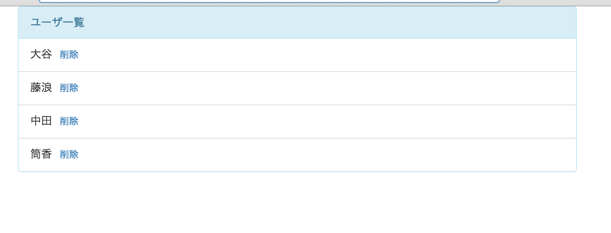

# 課題３
## やること
* 削除ボタンを押すとユーザが削除される

## 覚えてほしいこと
* eventの書き方
* eventが発生して処理が実行されるフロー

## ユーザ削除機能

#### 削除ボタンの追加
* 課題２までで完成しているものに機能を追加していきます
* 一覧で表示されている各ユーザの名前の横に削除ボタンを追加します
* index.htmlのid="user_view"の部分を修正します
<pre>
  ``
</pre>
* aタグの行が新しく追加した内容です
* classを4つ指定していますがbtnから始まるものはbootstrapを使って見た目を変えるもので、deleteはこの後の処理で使用するために指定したものです
* この段階でindex.htmlをブラウザで表示すると見た目だけはできているはずです

#### 削除イベントの登録
* 削除ボタンをクリックした時の動きを記述していきます
* 先ほどの作業で削除ボタンを入れたhtmlはid="user_view"の部分でした
* なのでこの削除ボタンについて管理するのはUserViewということになります
* UserViewに削除イベントを記述します
* templateとrenderの間辺りに以下の内容を追記します
<pre>
    `events: {`
      `'click .delete': 'deleteUser'`
    `},`
</pre>
* これはclassがdeleteの部分をclickしたらdeleteUserメソッドを実行するという意味になっています
* clickの部分にはmouseoverやdblclick等も指定することができます
* .deleteの部分はjQueryのセレクタの形のものを指定できます
* イベントの登録部分ができたので発火時に呼び出されるdeleteUserメソッドを作ります
* renderの下に以下の内容を追記して下さい(renderの閉じカッコの後にカンマを追加するのを忘れずに「},」)
<pre>
  `deleteUser: function(e) {`
    `e.preventDefault();`
    `this.model.destroy();`
  `}`
</pre>
* 新しい内容が出てきているので確認します
  * function(e)
    * functionに引数を指定すると一つ目の引数でjQueryのeventを取得できます
    * eの中身が気になったらconsole.log(e)として確認してみて下さい
  * e.preventDefault()
    * preventDefault()を実行すると発生しようとしていたイベントが全てキャンセルされます
    * ここではhrefに指定している#へのアクセスをキャンセルしています
  * this.model.destroy()
    * this.modelはこのviewに紐付けられたmodelです
    * modelのdestroyメソッドを呼び出すことでそのmdelは破棄されます
* ここまでで削除ボタンをクリックするとmodelが削除されるという処理が完成しました
* ですが、内部的にmodelが削除されるだけで、すでに画面に表示されている内容はそのまま残っています
* 次は表示内容の更新の処理を書いていきます

#### modelの変更を検知して画面を再描画する
* 一覧で表示しているユーザの表示を変更する処理なのでcollectionと紐付いているUsersViewに処理を記述します
* templateとrenderの間に以下の処理を書いて下さい
<pre>
    `initialize: function () {`
        `this.listenTo(this.collection, 'all', this.render);`
    `},`
</pre>
* 内容について確認します
  * initialize
    * initializeメソッドはnewした時に実行されます
  * this.listenTo(this.collection, 'all', this.render)
    * listenToメソッドはオブジェクトの状態を監視を開始するメソッドです
    * this.collectionが監視する対象
      * collectionやmodelを指定する
    * 'all'が監視する動作
      * 今は全ての動作を指定していますが、modelが削除された場合とかcollectionにmodelが追加された場合とかmodelの特定のカラムが更新された場合等細かな指定も可能です
      * http://backbonejs.org/#Events-catalog
    * this.renderが監視する対象が監視する動作をした時に呼び出すメソッド
  * この記述によりUserViewがnewされたタイミングで、紐付いているcollectionの状態の監視をスタートし、collectionが持っているmodelが削除された場合等を検知してrenderを実行して再描画します

#### 正しく動くか確認
* 修正が完了したのでgulpコマンドを実行して下さい
* 実行が完了したらindex.htmlをブラウザで開いて下さい
* 以下の画面が表示されるはずです
* 削除をクリックしてその行が消えればOKです

#### 開発内容の確認
* 課題3が完了した状態のサンプルがあるので自分で書いたコードと見比べて見てください
* [kadai3](./kadai3)
