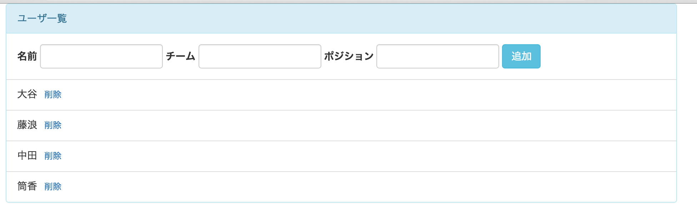
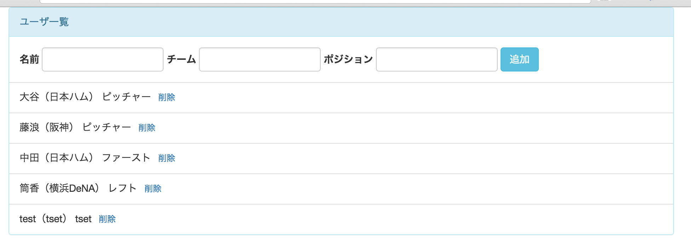

# 課題４
## やること
* 登録フォームを作成してユーザを追加できるようにする

## 覚えてほしいこと
* これまでに課題を踏まえてViewの追加をする

## フォームの作成

#### カラムを増やす
* nameだけでは寂しいのでteamとpositionのカラムも追加します
* scripts/main.jsを修正する
<pre>
  `var users = new Users([`
    `{name: '大谷', team: '日本ハム', position: 'ピッチャー'},`
    `{name: '藤浪', team: '阪神', position: 'ピッチャー'},`
    `{name: '中田', team: '日本ハム', position: 'ファースト'},`
    `{name: '筒香', team: '横浜DeNA', position: 'レフト'}`
  `]);`
</pre>
* index.htmlを修正する
* id="user_view"のnameの部分をに他のカラムも追加します
<pre>
  `<%- name %>（<%- team %>） <%- position %>`
</pre>

#### index.htmlに追記
* 新しく作成するformについて先にhtmlを整えておきます
* まずは見た目のイメージを確認します
* 完成形を確認したいので、id="users_view"のかたまりのclass="panel-heading"の下の行に以下の内容を追記して下さい
<pre>
  `
`
    `<form class="form-inline">`
      `
`
        `<label class="control-label">名前</label>`
        `<input type="text" id="name" class="form-control">`
      `
`
      `
`
        `<label class="control-label">チーム</label>`
        `<input type="text" id="team" class="form-control">`
      `
`
      `
`
        `<label class="control-label">ポジション</label>`
        `<input type="text" id="position" class="form-control">`
      `
`
      `<button type="button" id="add_user" class="btn btn-info">追加</button>`
    `</form>`
  `
`
</pre>
* この状態でindex.htmlを開くと以下のような画面が表示されるはずです
* 確認できたら今追記した内容は一旦削除して元に戻して下さい

* htmlの内容を確認できたのでviewから呼び出せるように``
</pre>
* 次にこのhtmlを入れ込むスペースを作ります
* 以下の内容をid="users_view"のかたまりのclass="panel-heading"の下の行に追加して下さい
<pre>`
`</pre>
* このdivの中にformを入れ込むことになります
* index.htmlの準備はこれでOKです

#### FormViewの作成
* 入力フォームを追加したいのでViewを新しく作成します
* scripts/views/にFormView.jsを作成して下さい
* ライブラリの読み込みます
<pre>
  `var $ = require('jquery');`
  `var _ = require('underscore');`
  `var Backbone = require('backbone');`
</pre>
* Userモデルを使うのでそれも読み込みます
<pre>`var User = require('../models/User');`</pre>
* backboneのviewを継承したviewを定義します
<pre>
  `module.exports = Backbone.View.extend({`
    `// ここにviewの処理を書いていく`
  `});`
</pre>
* el,template,renderを書いていきます
  * まずelなのかtagNameなのかですが、このformは画面に１つしか表示しないので事前にindex.htmlに入れ込む領域を作りelで指定するパターンを採用します
* elはindex.htmlに追記したid="user_form"の領域を指定します
<pre>`el: '#user_form',`</pre>
* templateはindex.htmlで作ったid="form_view"の部分を指定します
<pre>`template: _.template($('#form_view').html()),`</pre>
* renderはこれまでと同様です
* modelとは紐付かないviewなのでtemplateに引数は渡しません
<pre>
  `render: function() {`
    `this.$el.html(this.template());`
    `return this;`
  `});`
</pre>
* viewの基本的な部分は完成しました

#### 追加ボタンを押したときの処理
* 追加ボタンを押した時の処理を引き続きFormView.jsに書いていきます
* まずは追加ボタンをクリックしたイベントを拾うところを書きます
* templateとrenderの間に以下の内容を追記して下さい
<pre>
  `events: {`
    'click #add_user': 'addUser'
  `},`
</pre>
* 追加ボタンのidにadd_userを設定しているので、上記の内容は追加ボタンをクリックしたらaddUserメソッドを呼ぶという意味になります
* renderメソッドの下にaddUserメソッドを作成します
<pre>
  `addUser: function() {`
    `// ユーザ追加の処理を書く`
  `}`
</pre>
* addUserメソッドに書く処理は以下の内容です
  1. 各入力域から入力内容を取得する
  1. Userモデルを作成し入力内容をsetする
  1. 保存してcollectionに追加する
* 順番に見ていきます
  1. 各入力域から入力内容を取得する
    * jQueryを使って入力内容を取得します
    * 各入力域にはカラム名と同じidを設定してあります
    * trmi()をつけることで先頭と末尾にあるスペースを取り除くことができます
    <pre>
      `var name = $('input#name').val().trim();`
      `var team = $('input#team').val().trim();`
      `var position = $('input#position').val().trim();`
    </pre>
  1. Userモデルを作成し入力内容をsetする
    * Userモデルをnewして値をsetします
    * 中身が空の場合はデフォルト値を入れたいのでsetしません(デフォルト値の定義は後述)
    <pre>
      `var user = new User();`
      `if(name) user.set('name', name);`
      `if(team) user.set('team', team);`
      `if(position) user.set('position', position);`
    </pre>
  1. 保存してcollectionに追加する
    * createとするとmodelを保存してcollectionに追加されます
    <pre>`this.collection.create(user);`</pre>

#### formをrenderする処理の追加
* UsersViewをrenderする時にまとめてFormViewもrenderするようにしたいのでUsersView.jsのrenderメソッドを修正します
* FormViewを使用するのでrequireします
<pre>`var FormView = require('./FormView');`</pre>
* renderメソッドのthis.$el.html(this.template());の下に以下の内容を追加して下さい
<pre>
  `var formView = new FormView({collection: this.collection});`
  `formView.render()`
</pre>
* FormViewをnewしてrenderしています
* newするときにcollectionを渡すことで、FormView側の処理で新しくmodelを作成したした時に既存のcollectionに追加できるようにしています
* ここまででユーザを追加できるようになっているはずなのでgulpコマンドを実行し操作して見て下さい
* 以下の画面が表示され追加したユーザが表示されればOKです

#### モデルのデフォルト値の追加
* 今のままでは全てからで追加を押した時にうまく動作しません
* モデル側でデフォルト値を設定することができます
* scripts/User.jsに以下の内容を追記して下さい
<pre>
  `defaults: {`
    `name: '名無し',`
    `team: '無所属',`
    `position: '全部'`
  `}`
</pre>
* gulpを実行して画面を確認して下さい
* 空欄のまま追加を押して設定したデフォルト値が入っていればOKです

#### 開発内容の確認
* 課題4が完了した状態のサンプルがあるので自分で書いたコードと見比べて見てください
* [kadai4](./kadai4)
