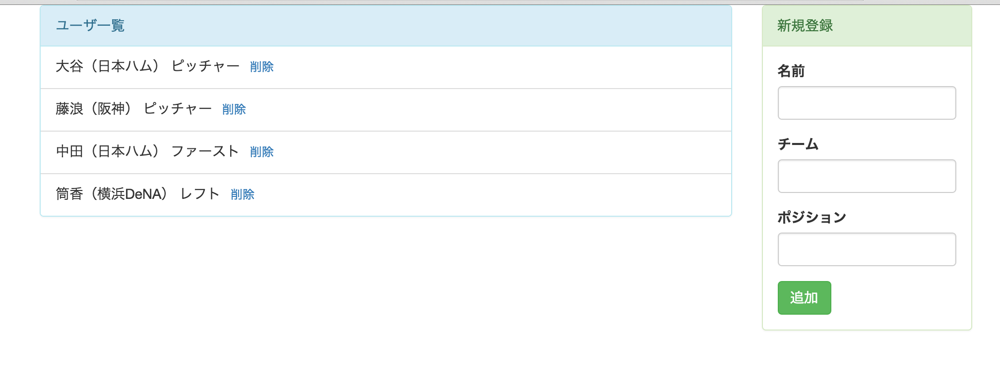

# 課題６
## やること
* marionetteのregionを使う

## 覚えてほしいこと
* marionetteのregionの使い方

## regionって何なのか

* (図を使ってわかりやすく説明しているブログがあったんだけど見つからない。。。)

## レイアウトの変更

* region適用のためにレイアウトを少し変更します
  * ユーザ一覧と新規登録を別のパネルで表示するようにする
* index.htmlを修正します
  * ユーザ一覧と新規登録を入れ込むスペースを作る
  <pre>`

`</pre>
  ↓
  <pre>
      `
`
        `
`
          `
`
          `
`
          `
`
          `
`
        `
`
      `
`
  </pre>
  * 以下の行を削除
  <pre>`

`</pre>
  * id="form_view"の部分を以下に変える
  <pre>
      ``
  </pre>
* FormView.jsを修正します
  * elは不要になるので削除します
* UsersView.jsを修正します
  * elは不要になるので削除します
  * FormViewのrenderはユーザ一覧とは別の部分で行うので削除します
    * FormViewのrequireを削除する
    * FormViewのrenderを削除する

## regionを適用する

* 下準備が長くなりましたがここからregionを使っていきます
* main.jsを修正します
  * marionetteとFormViewのrequireを追加
  <pre>var Marionette = require('backbone.marionette');</pre>
  <pre>var FormView = require('./views/FormView');</pre>
  * marionetteのApplicationのインスタンスを作成します
  <pre>
    var app = new Marionette.Application({
      // 中身は後で
    });
  </pre>
  * Applicationをstartさせます
    * 最後の行に追加する
    <pre>app.start();</pre>
  * new Marionette.Application({の中を書いていきます
    * ユーザ一覧と新規登録のregionを設定します
      <pre>
        regions: {
          users: '#users',
          newUser: '#new_user'
        },
      </pre>
      * それぞれどの領域(どのidの部分)に入れ込むか設定している
    * Applicationのstart時に描画されるようにする
      <pre>
        onStart: function() {
          this.users.show(new UsersView({collection: users}));
          this.newUser.show(new FormView({collection: users}));
        }
      </pre>
      * onStartはApplicationがstartした後に呼ばれる
      * this.usersとthis.newUserは設定したregionを呼んでいる
      * .showとすると引数で渡したviewがregionの領域にrenderされる

## 機能の追加

* 追加を押した後に入力していた内容が残ってしまうので消えるようにする
* FormViewを修正
  * uiに以下の内容を追加
  <pre>inputs: 'input'</pre>
  * addUserの最後に以下の内容を追加
  <pre>this.ui.inputs.val('');</pre>
  * inputsという変数でinputタグ全てを指定している
    * inputタグ全部だと予期いない別のinputまで含んじゃうんじゃないのと思うかもしれないが、各viewは自分のtemplateの内側しか見えていないので大丈夫
  * .val('')とすることで空文字を入れ空白に戻している

## 動作確認

* gulpを実行し動作を確認して下さい
* 見た目は以下のようになっているはずです

#### 開発内容の確認
* 課題６が完了した状態のサンプルがあるので自分で書いたコードと見比べて見てください
* [kadai6](./kadai6)

  
  
  
