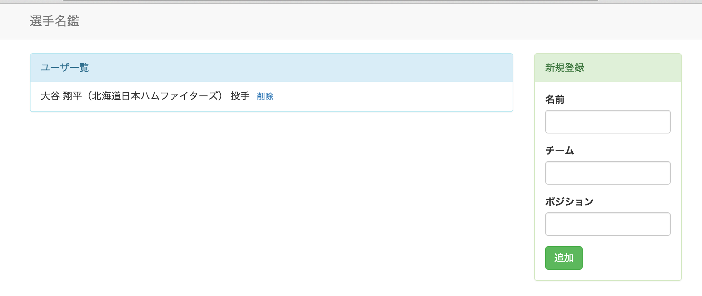

# 課題７
## やること
* marionetteのcompositeViewを使う

## 覚えてほしいこと
* 親子関係のあるviewの扱い方を覚える

## UsersViewとUserViewの関係をmarionetteを使って簡略化する

* UsersViewとUserViewは親子関係にある
  * UsersViewの中でUserViewがいくつも作られてappnedされている
* marionetteの機能を使うと親子関係にあるviewを簡単に書ける

#### UsersViewにcompositeViewを適用

* 継承するviewをItemViewからCompositeViewに変更する
  * compositeViewはviewが親子関係にある時の親のviewのこと
  <pre>module.exports = Marionette.CompositeView.extend({</pre>
* 子供のviewがどれなのかを指定する
  * templateの上に以下の記述を追加して下さい
  <pre>childView: UserView,</pre>
* 子供のviewをappendする場所を指定する
  * childViewの下に以下の記述を追加して下さい
  <pre>childViewContainer: '#user_list',</pre>
* 子供のviewをrenderする処理はmarionetteがやってくれるので削除する
  * onRenderごと削除して下さい
  * uiも使わなくなるので削除して下さい
* gulpを実行して動作を確認してみて下さい
* 今まで通りの動きをしていればOKです

#### event部分の削除

* 現在はUsersViewでcollectionEventsを設定し、collectionに追加や削除がされたことを検知して再renderしていました
* このcollectionの監視もmarionette側で定義されているので自分で書く必要はありません
* UsersViewのcoollectionEventsは削除して下さい

## 機能の修正

#### headerを追加する

* headerを追加します
* 完成イメージはこんなです

##### HeaderView.jsを作る
* viewsディレクトリにHeaderView.jsを作って下さい
* 内容は以下の通りです(marionetteを使うと新しいviewもこれしか書かなくてすむ！)
<pre>
  var Marionette = require('backbone.marionette');

  module.exports = Marionette.ItemView.extend({
    template: '#header_view'
  });
</pre>

##### main.jsの修正
* requireの追加
<pre>var HeaderView = require('./views/HeaderView');</pre>
* regionに追加
<pre>header: '#header',</pre>
* onStartの中でのshowを一行追加
<pre>this.header.show(new HeaderView());</pre>

##### index.htmlの修正
* header用のテンプレートを追加
<pre>
  ``
</pre>

#### DBとの連携(ここはmarionette関係ないです。。)

* 今までは、DB(Backbone.lovalstorage)を使っておきながら、毎回表示内容を初期化してDBを全く活用していませんでした
* なのでDBをちゃんと使うように修正します

##### main.jsの修正

* 毎回データを作って無理やりcollectionに入れていた部分を修正します
<pre>
  var users = new Users([
      {name: '大谷', team: '日本ハム', position: 'ピッチャー'},
      {name: '藤浪', team: '阪神', position: 'ピッチャー'},
      {name: '中田', team: '日本ハム', position: 'ファースト'},
      {name: '筒香', team: '横浜DeNA', position: 'レフト'}
  ]);
</pre>
↓
<pre>var users = new Users();</pre>

* DBにアクセスしてデータを取得するようにする
  * onStartの中を修正します
  <pre>
    onStart: function() {
      this.users.show(new UsersView({collection: users}));
      this.newUser.show(new FormView({collection: users}));
    }
  </pre>
  ↓
  <pre>
    onStart: function() {
      users.fetch().done(function() {
        this.users.show(new UsersView({collection: users}));
        this.newUser.show(new FormView({collection: users}));
      }.bind(this));
    }
  </pre>
    * fetchはcollectionのメソッドです
    * users.fetchとすることでDBにアクセスしてデータを取得しています
    * .doneはデータの取得が正常に完了すると実行されます
    * .bind(this)はdoneの中で外と同じthisを扱うためにつけています
* gulpを実行してページにアクセスして見て下さい
* これまで保存されたデータが全て表示されています

#### 開発内容の確認
* 課題７が完了した状態のサンプルがあるので自分で書いたコードと見比べて見てください
* [kadai7](./kadai7)

  
  
  
