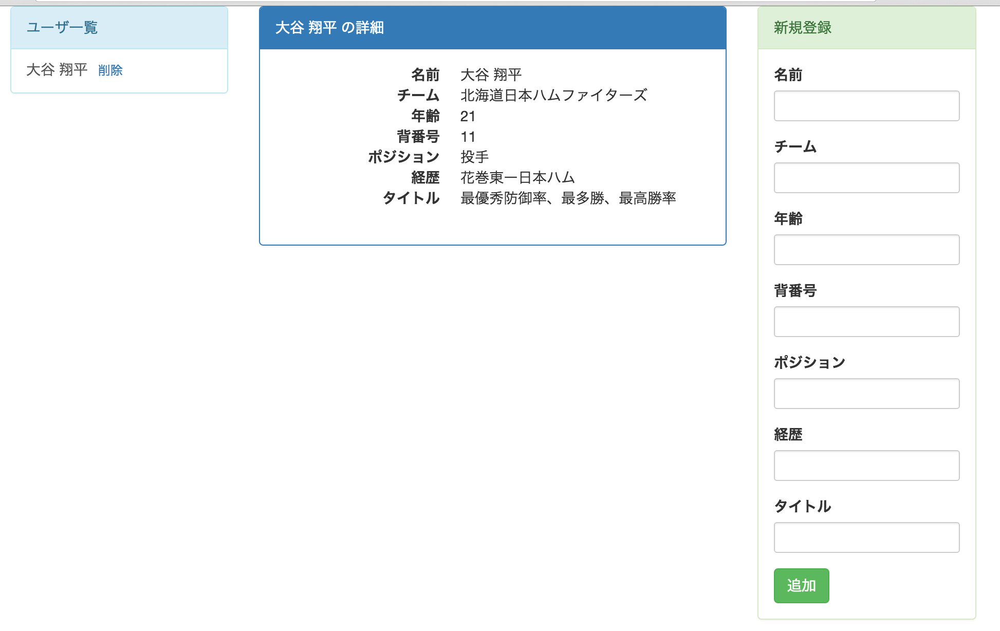
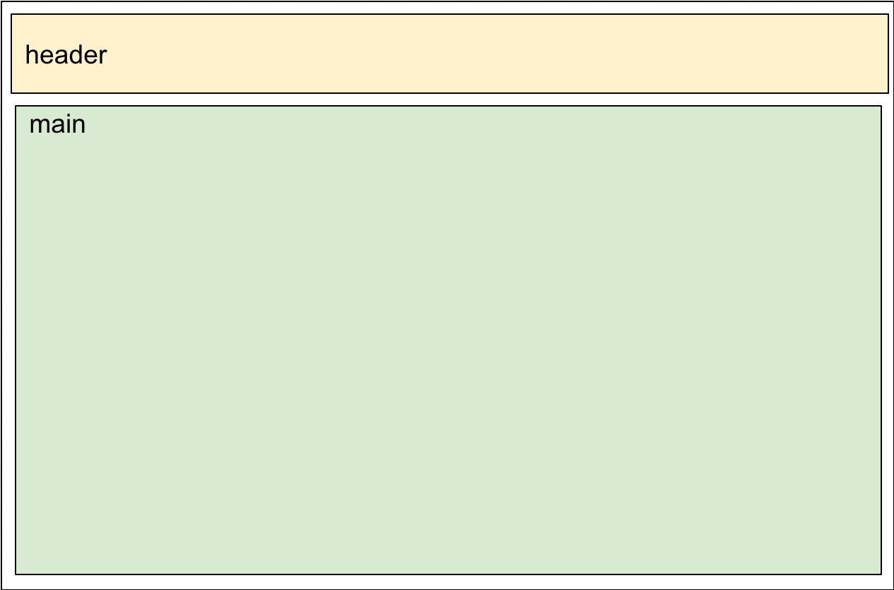
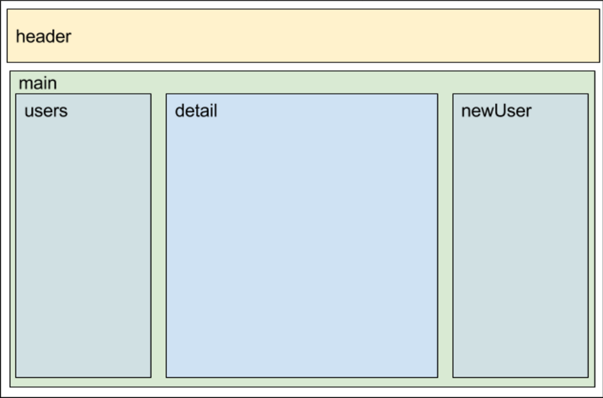

# 課題８
## やること
* marionetteのLayoutViewを使う

## 覚えてほしいこと
* LayoutViewを使ってregionを入れ子にする方法

## レイアウトを変更する
* ユーザの名前だけを出す一覧を作って、名前をクリックするとその人の詳細が真ん中に表示されるようにする
* 完成形のイメージはこんな

* ちなみに課題７までではこんな感じになっています

## modelのカラムを増やす
* ユーザの詳細画面を作成することになるのでカラムをもう少し増やしてみます
  * 年齢(age)、背番号(number)、経歴(career)、タイトル(title)を追加します

#### index.htmlの修正
* id="form_view"の部分に以下の形式のものを追加します
  * labelの中には日本語で、inputのidには英語のものを入れて下さい
  <pre>
    `
`
      `<label class="control-label">xxxx</label>`
      `<input type="text" id="xxxx" class="form-control">`
    `
`
  </pre>
* 上記の形式で、年齢と背番号はポジションの上に、経歴とタイトルはポジションの下に追加して下さい
* 新規登録の表示領域が小さめになったので入力域の大きさを少し小さくします
  * 全てのinputのclassにinput-smを追加して下さい
<pre>
    ``
</pre>

#### FormViewの修正
* 新しく追加したカラムの内容が保存されるように修正します
* uiの追加
<pre>
  inputAge: 'input#age',
  inputNumber: 'input#number',
  inputCareer: 'input#career',
  inputTitle: 'input#title',
</pre>
* 値の取得とmodelへのsetを追加
<pre>
    var age = this.ui.inputAge.val().trim();
    var number = this.ui.inputNumber.val().trim();
    var career = this.ui.inputCareer.val().trim();
    var title = this.ui.inputTitle.val().trim();
    if(age) user.set('age', age);
    if(number) user.set('number', number);
    if(career) user.set('career', career);
    if(title) user.set('title', title);
</pre>

#### userモデルの修正
* user.jsにデフォルト値も追加しておきます
<pre>
    age: 0,
    number: 999,
    career: 'なし',
    title: 'なし'
</pre>

#### 動作確認
* データが登録されているか確認するためにindex.htmlにデバッグ用コードを追加します
* id="user_view"の中に以下の1行を入れて動かしてみる
<pre><%- age %> <%- number %> <%- career %> <%- title %></pre>
* gulpを実行して動きを確認して下さい
* 追加したカラムの内容が表示されればOKです
  * エラーが出る場合はブラウザのコンソールで以下の内容を実行しDBを空っぽにしてから試して下さい
  <pre>localStorage.clear()</pre>
* 上記のデバッグ用のコードは消しておいて下さい

## regionの構成を変える
* 修正後のイメージはこんな感じです

* main.jsでheaderとmainのregionを作り、mainの中で残りの3つのregionを作る構成にします
  * 今はmain.jsでheaderとusersとnreUserを作っている

#### 1階層目
* 最初の階層はmain.jsでheaderとmainのregionを定義しviewをshowします

##### MainViewを作る
* views/MainView.jsを作成して下さい
* この後MainViewの中にregionを定義するのでLayoutViewを継承します
  * いくつかあるviewの中でLayoutViewだけがregionを定義することができます
* 今は最低限だけ書いておきます
<pre>
    var Marionette = require('backbone.marionette');

    module.exports = Marionette.LayoutView.extend({
      template: '#main_view'
    });
</pre>

##### main.jsの修正
* FormViewとUsersViewは使用しないのでrequireを削除します
* MainViewをrequireします
<pre>var MainView = require('./views/MainView');</pre>
* regionをheaderとmainだけにする
<pre>
    regions: {
        header: '#header',
        main: '#main'
    },
</pre>
* onStartの中ではheaderにHeaderViewを、mainにMainViewをshowするようにします
<pre>
    onStart: function() {
      users.fetch().done(function() {
        this.header.show(new HeaderView());
        this.main.show(new MainView({collection: users}));
      }.bind(this));
    }
</pre>

##### index.htmlの修正
* 以下の部分を修正します
<pre>
  `
`
    `
`
      `
`
      `
`
      `
`
      `
`
    `
`
  `
`
</pre>
↓
<pre>
    `

` 
    ``
</pre>

##### 動作確認
* 動作確認用に`<script id="main_view" type="text/template">`の下に`<h1>テスト</h1>`と入れてみて下さい
* gulpを実行し画面表示して下さい
* header部分ととデバッグ用に入れた「テスト」の文字が出てればOKです
  * 確認が終わったら`<h1>`の部分は消しておいて下さい
* ここまでで以下の図の部分までできました

#### 2階層目
* 次にmainViewでusersとdetailとnewUserのregionを定義しviewをshowします
* まずは既存のものが画面に表示されるようにします

##### mainView.jsの修正
* regionを定義する
  * main.jsの時と同じように定義します
  <pre>
      regions: {
        users: '#users',
        newUser: '#new_user'
      }
  </pre>
* ユーザ一覧と新規登録フォームを表示させる
  * UsersViewとFormViewをrequireする
  <pre>
    var UsersView = require('./UsersView');
    var FormView = require('./FormView');
  </pre>
  * MainView自身のrenderが終わった後にUsersViewとFormViewもrenderさせたいのでonRenderメソッドを使います
  <pre>
    onRender: function() {
      //中身はこれから  
    }
  </pre>
  * onRenderの中でregionに各viewをshowします
  <pre>
    this.users.show(new UsersView({collection: this.collection}));
    this.newUser.show(new FormView({collection: this.collection}));
  </pre>

##### 動作確認
* gulpを実行して動作を確認して下さい
* これまでと同様の動きができればOKです

#### 開発内容の確認
* 課題８が完了した状態のサンプルがあるので自分で書いたコードと見比べて見てください
* [kadai8](./kadai8)

  
  
  
