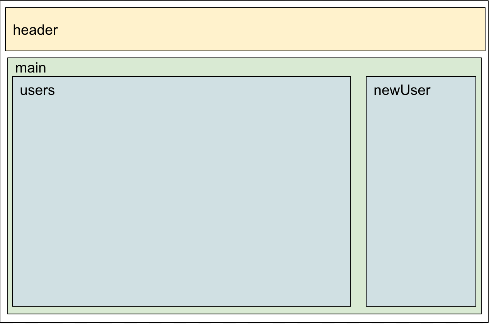
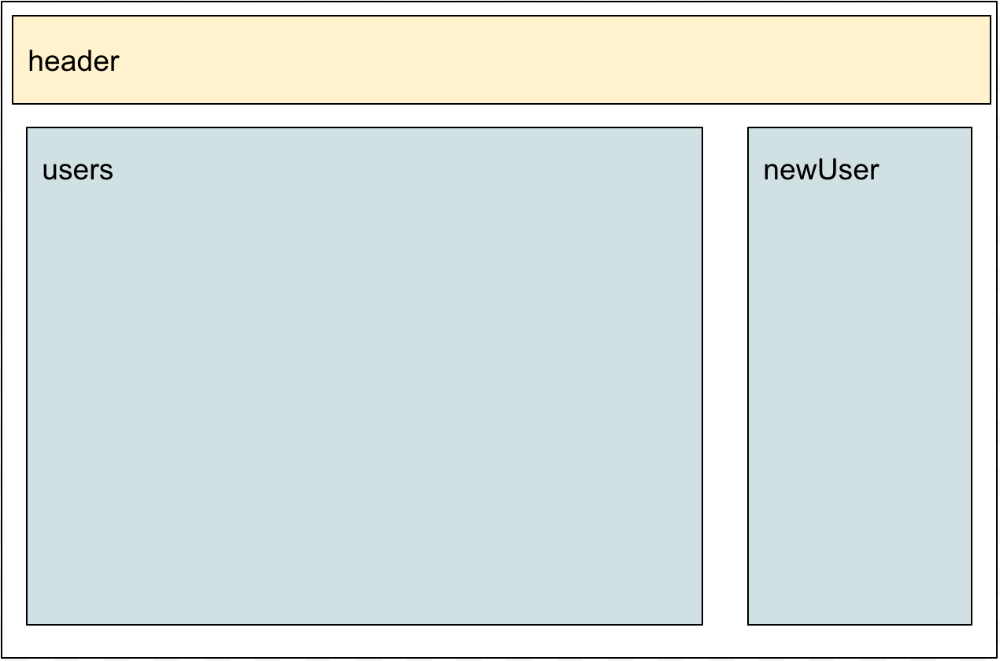

# 課題８
## やること
* marionetteのLayoutViewを使う

## 覚えてほしいこと
* LayoutViewを使ってregionを入れ子にする方法

## regionの構成を変える
* 修正後のイメージはこんな感じです

* main.jsでheaderとmainのregionを作り、mainの中で残りの3つのregionを作る構成にします
  * 今はmain.jsでheaderとusersとnreUserを作っている
  

#### 1階層目
* 最初の階層はmain.jsでheaderとmainのregionを定義しviewをshowします

##### MainViewを作る
* views/MainView.jsを作成して下さい
* この後MainViewの中にregionを定義するのでLayoutViewを継承します
  * いくつかあるviewの中でLayoutViewだけがregionを定義することができます
* 今は最低限だけ書いておきます
<pre>
    var Marionette = require('backbone.marionette');

    module.exports = Marionette.LayoutView.extend({
      template: '#main_view'
    });
</pre>

##### main.jsの修正
* FormViewとUsersViewは使用しないのでrequireを削除します
* MainViewをrequireします
<pre>var MainView = require('./views/MainView');</pre>
* regionをheaderとmainだけにする
<pre>
    regions: {
        header: '#header',
        main: '#main'
    },
</pre>
* onStartの中ではheaderにHeaderViewを、mainにMainViewをshowするようにします
<pre>
    onStart: function() {
      users.fetch().done(function() {
        this.header.show(new HeaderView());
        this.main.show(new MainView({collection: users}));
      }.bind(this));
    }
</pre>

##### index.htmlの修正
* 以下の部分を修正します
<pre>
  `
`
    `
`
      `
`
      `
`
      `
`
      `
`
    `
`
  `
`
</pre>
↓
<pre>
    `

` 
    ``
</pre>

##### 動作確認
* 動作確認用に`<script id="main_view" type="text/template">`の下に`<h1>テスト</h1>`と入れてみて下さい
* gulpを実行し画面表示して下さい
* header部分ととデバッグ用に入れた「テスト」の文字が出てればOKです
  * 確認が終わったら`<h1>`の部分は消しておいて下さい
* ここまでで以下の図の部分までできました

#### 2階層目
* 次にmainViewでusersとdetailとnewUserのregionを定義しviewをshowします
* まずは既存のものが画面に表示されるようにします

##### mainView.jsの修正
* regionを定義する
  * main.jsの時と同じように定義します
  <pre>
      regions: {
        users: '#users',
        newUser: '#new_user'
      }
  </pre>
* ユーザ一覧と新規登録フォームを表示させる
  * UsersViewとFormViewをrequireする
  <pre>
    var UsersView = require('./UsersView');
    var FormView = require('./FormView');
  </pre>
  * MainView自身のrenderが終わった後にUsersViewとFormViewもrenderさせたいのでonRenderメソッドを使います
  <pre>
    onRender: function() {
      //中身はこれから  
    }
  </pre>
  * onRenderの中でregionに各viewをshowします
  <pre>
    this.users.show(new UsersView({collection: this.collection}));
    this.newUser.show(new FormView({collection: this.collection}));
  </pre>

##### 動作確認
* gulpを実行して動作を確認して下さい
* これまでと同様の動きができればOKです

#### 開発内容の確認
* 課題８が完了した状態のサンプルがあるので自分で書いたコードと見比べて見てください
* [kadai8](./kadai8)

  
  
  
