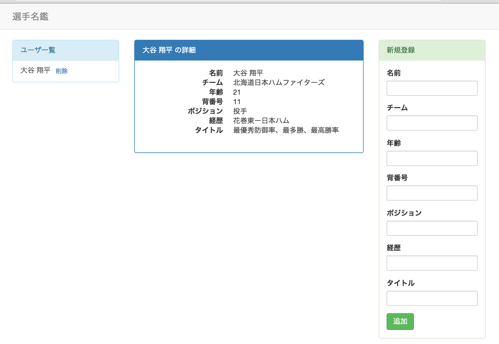

# 課題９
## やること
* regionに表示しているviewを切り替える

## 覚えてほしいこと
* 子供のregion(view)からのeventを親が受け取って表示内容を切り替える方法

## レイアウトを変更する
* ユーザの名前だけを出す一覧を作って、名前をクリックするとその人の詳細が真ん中に表示されるようにする
* 完成形のイメージはこんな

## modelのカラムを増やす
* ユーザの詳細画面を作成することになるのでカラムをもう少し増やしてみます
  * 年齢(age)、背番号(number)、経歴(career)、タイトル(title)を追加します

#### index.htmlの修正
* id="form_view"の部分に以下の形式のものを追加します
  * labelの中には日本語で、inputのidには英語のものを入れて下さい
  <pre>
    `
`
      `<label class="control-label">xxxx</label>`
      `<input type="text" id="xxxx" class="form-control">`
    `
`
  </pre>
* 上記の形式で、年齢と背番号はポジションの上に、経歴とタイトルはポジションの下に追加して下さい
* 新規登録の表示領域が小さめになったので入力域の大きさを少し小さくします
  * 全てのinputのclassにinput-smを追加して下さい
<pre>
    ``
</pre>

#### FormViewの修正
* 新しく追加したカラムの内容が保存されるように修正します
* uiの追加
<pre>
  inputAge: 'input#age',
  inputNumber: 'input#number',
  inputCareer: 'input#career',
  inputTitle: 'input#title',
</pre>
* 値の取得とmodelへのsetを追加
<pre>
    var age = this.ui.inputAge.val().trim();
    var number = this.ui.inputNumber.val().trim();
    var career = this.ui.inputCareer.val().trim();
    var title = this.ui.inputTitle.val().trim();
    if(age) user.set('age', age);
    if(number) user.set('number', number);
    if(career) user.set('career', career);
    if(title) user.set('title', title);
</pre>

#### userモデルの修正
* user.jsにデフォルト値も追加しておきます
<pre>
    age: 0,
    number: 999,
    career: 'なし',
    title: 'なし'
</pre>

#### 動作確認
* データが登録されているか確認するためにindex.htmlにデバッグ用コードを追加します
* id="user_view"の中に以下の1行を入れて動かしてみる
<pre><%- age %> <%- number %> <%- career %> <%- title %></pre>
* gulpを実行して動きを確認して下さい
* 追加したカラムの内容が表示されればOKです
  * エラーが出る場合はブラウザのコンソールで以下の内容を実行しDBを空っぽにしてから試して下さい
  <pre>localStorage.clear()</pre>
* 上記のデバッグ用のコードは消しておいて下さい

## regionを増やす
* mainの中のregionにdetailを追加します
* 完成イメージはこんな感じです

#### ユーザ一覧を修正
* ユーザ一覧には名前と削除ボタンだけを表示するようにします
  * index.htmlを修正
    * id="user_view"の部分を変える
      <pre><%- name %>（<%- team %>） <%- position %></pre>
      ↓
      <pre><%- name %></pre>
* 名前をクリックできるようにする
  * UserView.jsを修正
    * tagNameを変えます
      <pre>tagName: 'a',</pre>
    * href属性も追加します
      <pre>
        attributes: {
          href: '#'
        },
      </pre>

#### 詳細画面を作成

##### views/DetailView.jsを作成して下さい
* まずは最低限だけ書いときます
  <pre>
    var Marionette = require('backbone.marionette');
  
    module.exports = Marionette.ItemView.extend({
      template: '#detail_view'
    });
  </pre>
##### index.htmlに詳細画面を入れるスペースを作る
* id="main_view"の部分を修正
  <pre> 
    `
`
      `

`
      `

`
      `

`
    `
`
  </pre>
##### index.htmlにテンプレートを書く
<pre>
  ``
</pre>
##### main.jsを修正
* requireを追加
  <pre>var DetailView = require('./DetailView');</pre>
* regionを追加
  <pre>userDetail: '#user_detail',</pre>
* onRenderにdetailのrenderも追加
  * データが0件だとここでエラーが出ます。データが0件の時はこの行をコメントアウトしてデータを追加してから再実行して下さい
  <pre>this.userDetail.show(new DetailView({model: this.collection.models[0]}));</pre>
  * DetailViewはmodelと紐づくviewです
  * collectionの中の一番目のmodelを取得しています
##### 動作確認
* gulpを実行して画面を確認して下さい
* うまくいっていればこのような画面がでます

## 一覧の名前をクリックするとそのユーザの詳細が表示されるようにする
#### UserViewにクリックした時のイベントを設定する
* eventsに以下の内容を追加して下さい
  <pre>'click': 'showDetail'</pre>
  * すでに設定しているeventsは`'click .delete': 'deleteUser'`と書いていましたが今回はclickのみです
  * これはUserViewのtemplate内ならどこをクリックしても該当するということです
  * clickするとshowDetailメソッドが呼ばれます
* showDetailメソッドを作る
  <pre>
    showDetail: function(e) {
      e.preventDefault();
      this.triggerMethod('show:detail');
    }
  </pre>
  * preventDefaultは前にも出てきたクリックした時に起きようとしている動作をキャンセルするものです
  * triggerMethodは引数で渡したイベントを発火させるメソッドです
    * これを行うことで他のviewからでもclickされたことを検知できます
* ここまでで動作確認
  * showDetailメソッドにconsole.log('test');を追加して下さい
  * gulpを実行して画面を開いて下さい
  * ユーザ一覧の名前をクリックした時にブラウザのコンソールに「test」と表示されていればここまではOKです

#### クリックされたことをMainViewで検知して画面を切り替える
* MainViewにイベントが起きた時の動作を追記します
  * regionsの下に以下の内容を追記して下さい
  <pre>
    childEvents: {
        'show:detail': 'changeDetail'
    },
  </pre>
    * childEventsはLauoutViewの機能で、LayoutViewが持っているregion内で起きたイベントを検知することができます
    * UserViewで`this.triggerMethod('show:detail');`という風に`'show:detail'`のイベントが起きた時ここで検知できます
  * changeDetailメソッドの作成
  <pre>
    changeDetail: function(childView) {
        this.userDetail.show(new DetailView({model: childView.model}));
    }
  </pre>
    * childEventsで呼ばれたメソッドは引数でイベントが起きたviewを取得することができます
    * userDetailのregionの表示内容を切り替えていて、表示するmodelにchildViewのmodelを指定しています(クリックされたユーザを渡している)
* 動作確認
  * gulpを実行して画面を開いて下さい
  * ユーザ一覧の名前をクリックした時に詳細画面が切り替わればOKです

## 開発内容の確認
* 課題９が完了した状態のサンプルがあるので自分で書いたコードと見比べて見てください
* [kadai9](./kadai9)
